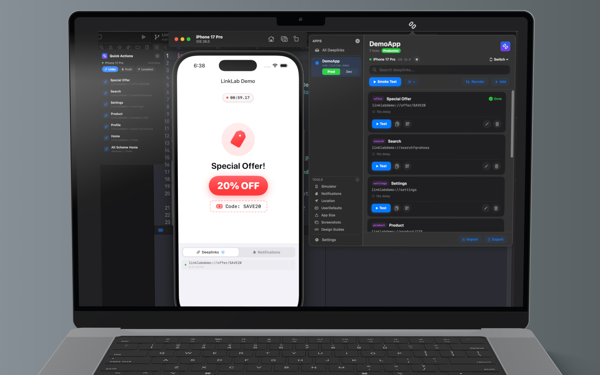
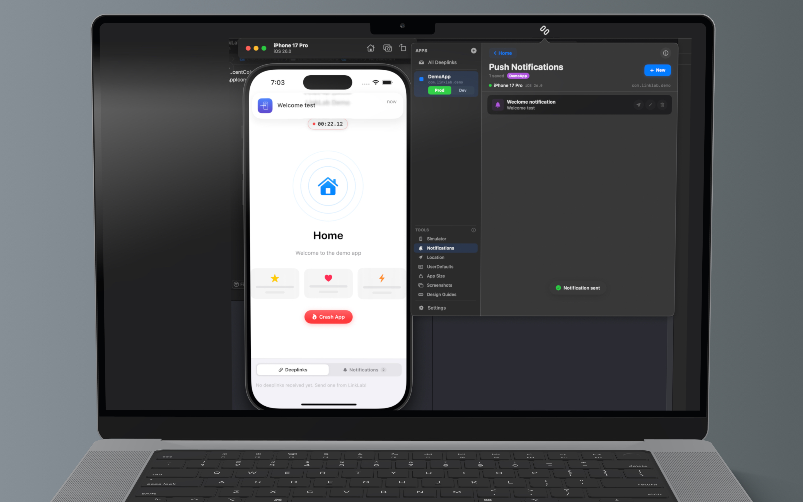
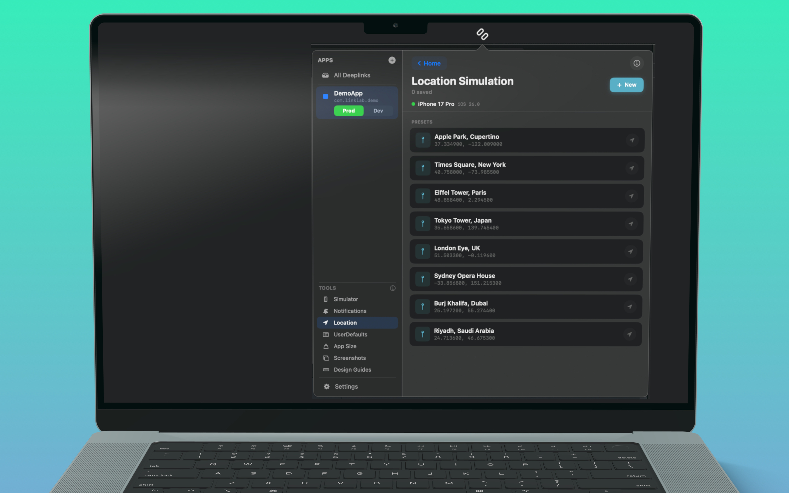
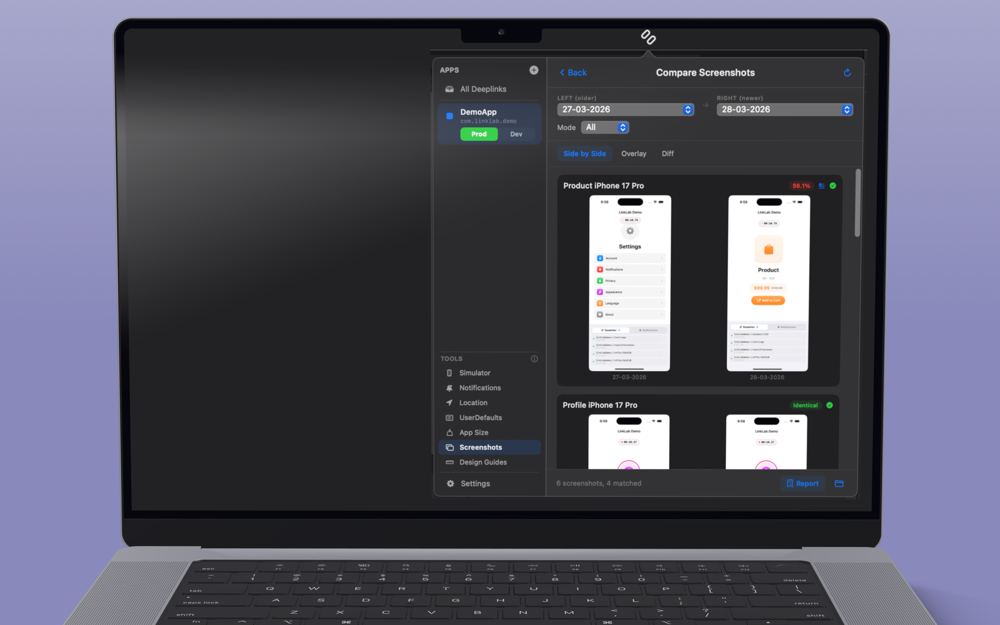
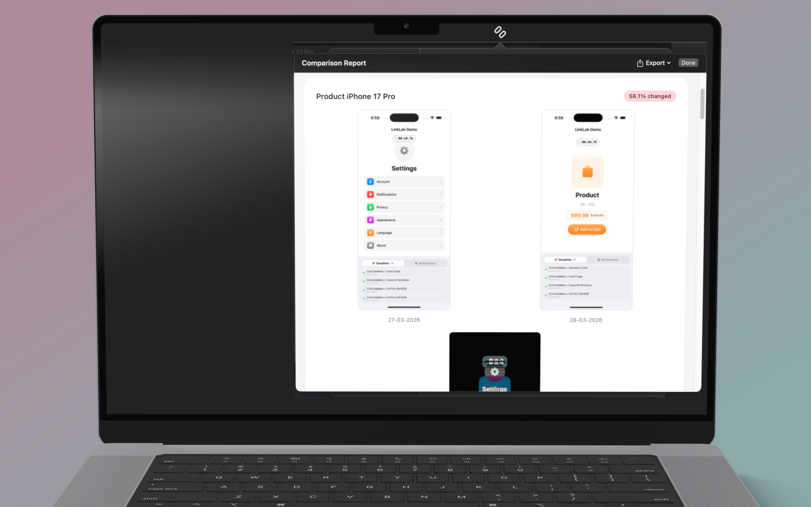
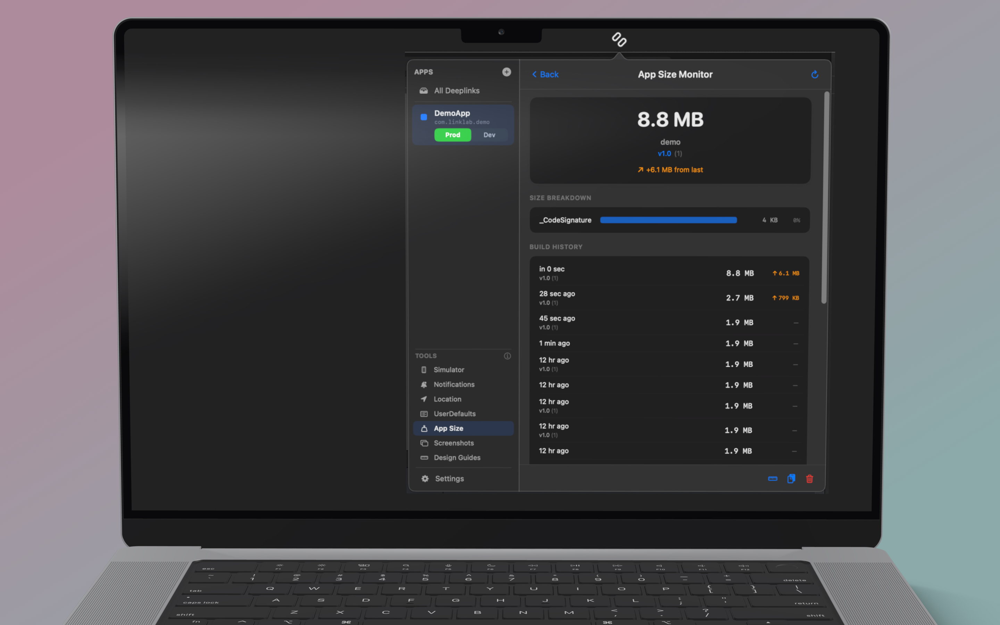
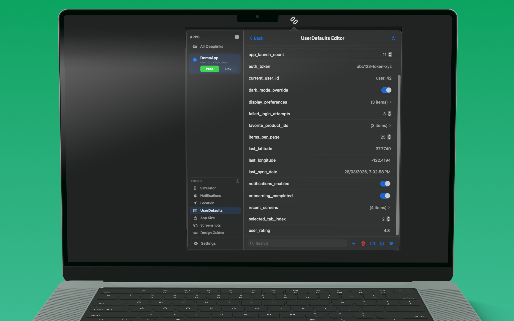
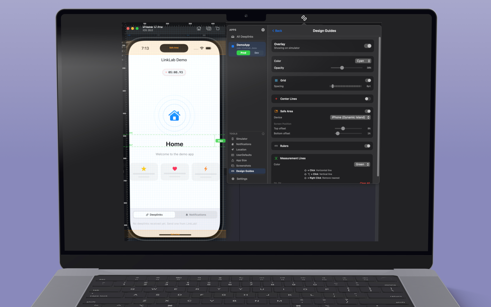

  

<h1 align="center">LinkLab</h1>

  <strong>The all-in-one iOS developer toolkit for macOS.</strong> 
  15 tools in your menu bar — deeplinks, push notifications, GPS simulation, screenshot comparison, and full simulator control.

  

  <a href="https://www.linklabapp.com">Website</a> &bull;
  <a href="https://www.linklabapp.com/support">Support</a> &bull;
  v1.0.3

---

## What is LinkLab?

LinkLab is a macOS menu bar toolkit that gives iOS developers 15 powerful tools — all accessible in one click. Test deeplinks, send push notifications, simulate GPS locations, compare screenshots, edit UserDefaults, monitor app size, and control simulators without ever opening Terminal.

  

## Features

### Deeplink Management & Smoke Testing
- Add, edit, delete, and reorder deeplinks with drag-and-drop
- Search and filter across all your deeplinks
- Copy any deeplink URL to clipboard instantly
- Generate QR codes for any deeplink on-demand
- Run all deeplinks automatically with video recording and screenshot capture
- Three test modes: **Normal**, **Cold Start**, and **Warm Start**
- Configurable time delays between tests

  

### Push Notification Testing
- Send real APNs-format push notifications to the simulator
- Configure title, body, badge, sound, and custom JSON payload
- Support for silent and mutable-content flags
- Save notification templates for reuse across apps

  

### Location Simulation
- Set GPS coordinates on any booted simulator
- Choose from preset city locations or enter custom latitude/longitude
- Test geo-fencing, location services, and map features

  

### Screenshot Comparison
- Capture screenshots during test runs automatically
- Compare side by side, overlay, or diff view
- Built-in OCR detects text changes between runs
- Visual regression testing with change percentage
- Generate exportable comparison reports

  

  

### App Size Monitor
- Track installed app bundle size over time
- View historical measurements in charts
- Size breakdown by component
- Export size reports for analysis

  

### UserDefaults Editor
- Read, modify, add, and delete UserDefaults entries on the simulator
- Reset onboarding, toggle feature flags, debug preferences
- Support for strings, numbers, booleans, arrays, and dictionaries
- Export and import UserDefaults as plist files

  

### Design Overlay
- Pixel grid overlay with adjustable spacing
- Rulers, center lines, and crosshair guides
- Device-specific safe area guides (iPhone, iPad)
- Custom guide lines with color and opacity control

### Simulator Control
- View all simulators with boot/shutdown status
- Boot, shutdown, erase, clone, rename, and delete simulators
- Create new simulators with custom device types and runtimes
- Search and filter by name, status, or iOS version

### Multi-App & Environment Support
- Manage deeplinks for multiple apps in one place
- Separate production and development bundle identifiers per app
- One-click environment switching
- Optional app termination after each test

### Import & Export
- Export deeplinks as JSON (includes app bundle metadata)
- Import deeplinks with smart conflict handling (skip or overwrite duplicates)
- Auto-creates app bundles from imported JSON metadata

### iCloud Sync
- Sync deeplinks, app bundles, and settings across your Macs
- Stored in your private iCloud container via CloudKit
- Disabled by default — opt-in from Settings

### Privacy & Security
- **Local-first** — all deeplinks, recordings, and data stay on your Mac
- Optional iCloud sync stays within your Apple ecosystem
- Anonymous crash reports and usage analytics only (via Firebase)
- App Sandbox with hardened runtime
- Works fully offline

## Requirements

- macOS 14.0 (Sonoma) or later
- Xcode with at least one iOS Simulator runtime installed

## Installation

Download LinkLab from the Mac App Store. It lives in your menu bar — click the icon to open.

## Pricing

| Plan | Price |
|------|-------|
| Free | Core deeplink testing & basic simulator control |
| Monthly | $4.99/month |
| 6 Months | $17.99 |
| Yearly | $19.99/year (Best Value) |

Pro unlocks all 15 tools with no limitations. All subscriptions managed through your Apple ID. Cancel anytime.

## License

LinkLab is proprietary software. All rights reserved.

## Contact

- Website: [www.linklabapp.com](https://www.linklabapp.com)
- Support: [www.linklabapp.com/support](https://www.linklabapp.com/support)
- Email: support@linklabapp.com
